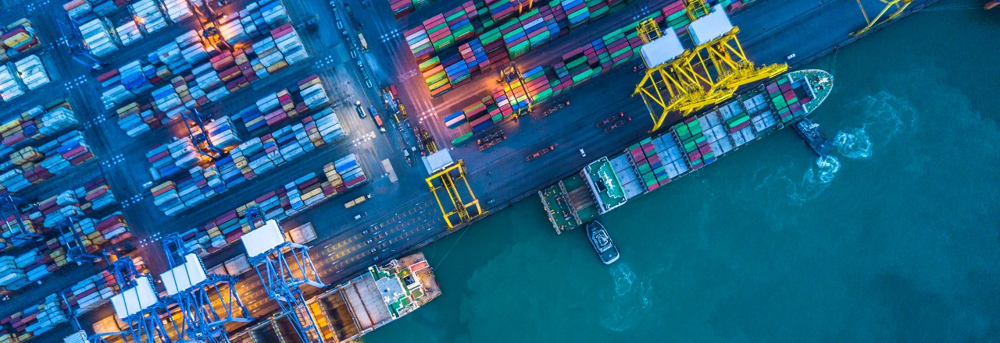

The maritime industry plays a pivotal role in global trade, connecting nations and facilitating the movement of goods around the world. However, like many sectors, it faces sustainability and environmental impact challenges. In recent years, maritime digital transformation has emerged as a powerful tool to address these challenges. The industry can enhance its operational efficiency, reduce emissions, and promote sustainable practices by harnessing advanced technologies. This blog explores the transformative potential of digitalisation in the maritime industry and how it contributes to a greener and more sustainable future.

## The Need for Change

The maritime sector faces various sustainability challenges, including carbon emissions, pollution, and inefficient processes. These issues impact the environment and threaten human health and marine ecosystems. Digital transformation offers a way to address these challenges by revolutionizing traditional practices and promoting sustainability at every level.

## Leveraging Data Analytics

Digitalization enables the collection and analysis of vast data, improving decision-making and operational efficiency. Through data analytics, maritime companies can optimize routes, reduce fuel consumption, and minimize emissions. Real-time monitoring of vessel performance and weather conditions allows for proactive measures to be taken, ensuring optimal operations while minimizing the environmental impact.

## Smart Ports and Supply Chain Management

Digital technologies enable the creation of smart ports and efficient supply chain management systems. Automated processes, such as intelligent cargo handling and optimized berthing, streamline operations and reduce energy consumption. Additionally, advanced tracking systems and data-sharing platforms enhance collaboration among stakeholders, facilitating the adoption of sustainable practices throughout the supply chain.
